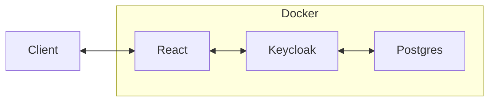

# Docker + Postgres + Keycloak + React

.env
POSTGRES_DB=keycloak
POSTGRES_USER=postgres
POSTGRES_PASSWORD=password

KC_BOOTSTRAP_ADMIN_USERNAME=admin
KC_BOOTSTRAP_ADMIN_PASSWORD=admin

VITE_KEYCLOAK_URL=http://localhost:8080
VITE_KEYCLOAK_REALM=template
VITE_KEYCLOAK_CLIENT_ID=template

