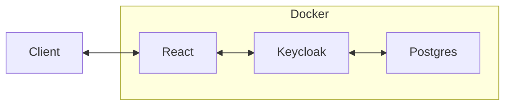

# Docker + Postgres + Keycloak + React

## 📐 Architecture



## 🧪 Getting started

Build the docker stack:

```
docker compose up -d --build
docker compose down
```

Build the docker stack (development):

```
docker compose up -d postgres keycloak
npm i
npm run dev
```

